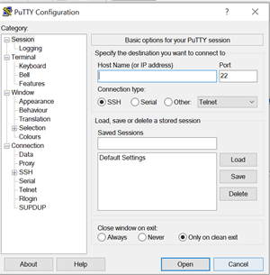
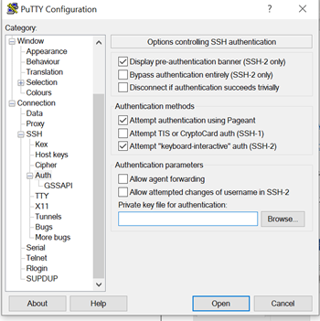

# Running a Geth node
## Prerequisites
1) Update the Software 

```bash
sudo apt update
sudo apt full-upgrade
```

## Security

The node need to be secure against attacks (because the VM will be visible from the outside) , we will secure the login with SSH key and disable the password. Then we will enable the Uncomplicated Firewall to control who is pirmitted (SSH and Electrum) . To prevent an attacker to try different password , we will use fail2ban (after five failed login attempts the service close acces for 10 minutes).

1) Log to the VM with Putty 
> [PuTTY](https://www.chiark.greenend.org.uk/~sgtatham/putty/latest.html) is an SSH and telnet client , download it and conect to the VM host with your credentials (host name,username and password)


<p align="center">  </p>

2) Login with SSH keys:
>  [Follow this guide](https://www.tecmint.com/ssh-passwordless-login-with-putty/) to generate SSH keys with PUTTY and login remotly to the server without passwords.

Generate the keys (public and private) and save them to a secure location.
Keep the public key in a text filed and paste it into the `.ssh/authorized_keys` file , we can add to this file all the public key authorized to acces to our server.
Save a session to automatically connect and login to the server with our orivate key.

<p align="center">  </p>

3) Disable the password

`!Make sure that you can connect with your SSH keys before!`
```bash
sudo nano /etc/ssh/sshd_config
```
We need to edit the SSH configuration and setting “ChallengeResponseAuthentication” and “PasswordAuthentication” to “no”, save it and restarting the SSH daemon and exit.
```sh
sudo systemctl restart sshd
exit
```

4) Enabling the UFW

```sh
sudo apt install ufw
sudo su
ufw default deny incoming
ufw default allow outgoing
ufw allow 22    comment 'allow SSH'
ufw allow 50002 comment 'allow Electrum SSL'
ufw enable
systemctl enable ufw
ufw status
```

5) Fail2ban

```sh
sudo apt install fail2ban
```
## Install dependencies
There's no particular dependencies in order to run Geth

## Install Geth
To enable launchpad repository run
```sh
sudo add-apt-repository -y ppa:ethereum/ethereum
```
Then install the stable version of go-ethereum:
```sh
sudo apt-get update
sudo apt-get install ethereum
```

## Running Geth on rinkeby network
We first create the file launchGeth.sh
```sh
nano launchGeth.sh
```
We add this arguments, you can consulte this link https://geth.ethereum.org/docs/rpc/server to see more about arguments.
```sh
geth --rinkeby --syncmode snap --http --http.addr 127.0.0.1 --http.api personal,eth,net,web3
```
We run Geth as a service so it can load the blocks continuously

```sh
sudo nano /etc/systemd/system/geth.service
```
```sh
# /etc/systemd/system/geth.service
[Unit]
Description=Geth

[Service]
Type=simple
User=administrateur2
Restart=always
RestartSec=12
ExecStart=/bin/bash /home/administrateur2/launchGeth.sh

[Install]
WantedBy=multi-user.target
```
Enable the service
```sh
 sudo systemctl enable geth.service
```

To monitor you can check the bitcoind status with :
```sh
 systemctl status geth.service
```
```sh
 systemctl start geth.service
```
And consulte logs with 
```sh
journalctl -fu geth
```

## Open the Rpc API to interact with your node
This link https://ethereum.stackexchange.com/questions/809/which-tcp-and-udp-ports-are-required-to-run-an-ethereum-client explains about which ports to use to run geth.
You need to open Port 30303
```sh
ufw allow 30303  comment '# allow Geth' 
```
You can use command netstat to see the state of your current ports

<p align="center">  </p>

Now you can connect to the javascript console of geth with
```sh
geth attach http://127.0.0.1:8545  
```
Check this link https://geth.ethereum.org/docs/interface/javascript-console for all available functions


## Extract last block number
**For this step wait for the node to be fully synchroned**
You can use either of these functions
```sh
eth.syncing
eth.blockNumber
```
<p align="center">  </p>

<p align="center">  </p>

## Show events data from a specific transaction
Use https://rinkeby.etherscan.io/ as an explorer to find an interesting tx.
Now use either of these commands still on geth console
```sh
eth.getTransaction(""txID")
eth.getTransactionReceipt("txID")
```


<p align="center">  </p>
